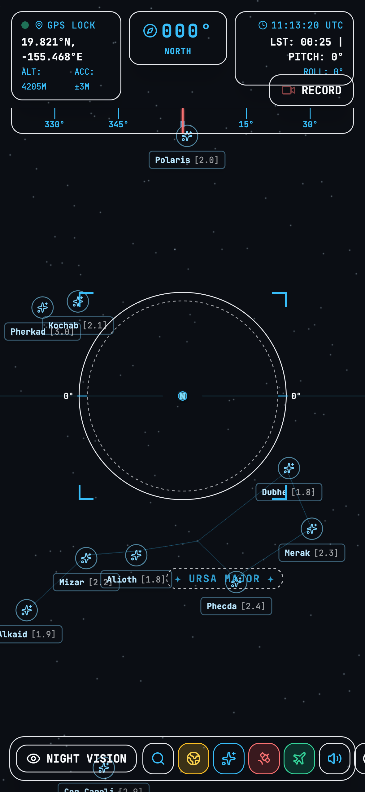
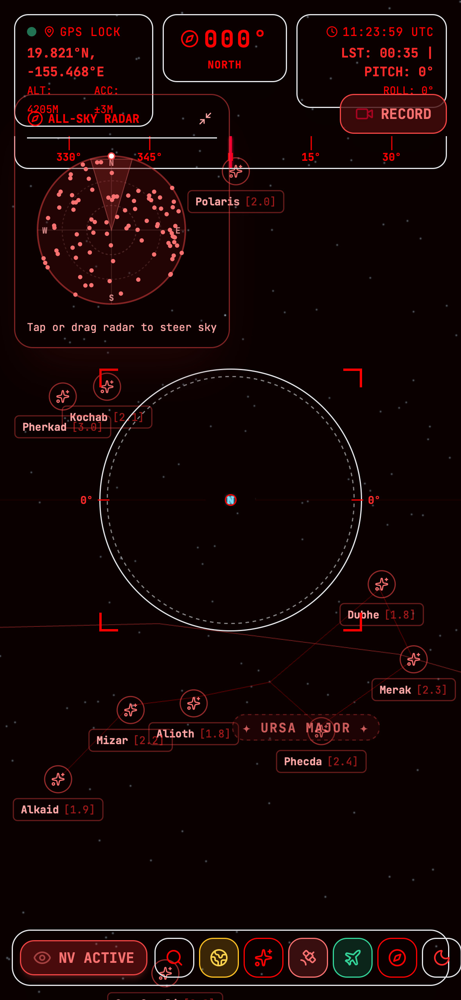

# OrbitLens: AR Night Sky Tracker & Orbital Telemetry PWA

[](https://github.com/FranekJemiolo/orbitlens/actions/workflows/ci.yml)
[](https://github.com/FranekJemiolo/orbitlens/actions/workflows/deploy.yml)
[](https://github.com/FranekJemiolo/orbitlens/actions/workflows/data-drift.yml)

**OrbitLens** is a progressive web application (PWA) delivering a real-time Augmented Reality (AR) overlay of the night sky for mobile Safari (iOS) and mobile Chrome (Android). Built with TypeScript, Vite, React, and Three.js, it superimposes stars, constellations, orbital satellites (ISS & Starlink), commercial aircraft, and meteor shower radiants onto the live camera stream.

🌐 **Live Demo:** [https://franekjemiolo.github.io/orbitlens/](https://franekjemiolo.github.io/orbitlens/)

---

## Visual Showcase

| Tactical HUD Overlay | Astro-Red Night Vision Mode |
| :---: | :---: |
|  |  |

---

## Key Features

- **High-Performance WebGL Celestial Canvas**: Renders ~5,000 naked-eye stars from the HYG database using an optimized 16-byte stride flat binary buffer (`stars.bin`) parsed directly into GPU `BufferGeometry`.
- **Real-Time Sensor Fusion**: Translates device gyroscope, compass heading, and tilt into a Three.js virtual camera orientation quaternion aligned with True North and Horizon.
- **Orbital Telemetry & SGP4 Propagator**: Fetches live TLEs from CelesTrak for the International Space Station (ISS) and Starlink satellites, propagated topocentrically using `satellite.js`.
- **Live ADS-B Aircraft Tracking**: Queries the OpenSky Network REST API for flights within the observer's geographic range and renders them as tactical altitude/bearing boxes.
- **Meteor Shower Radiants**: Visualizes active meteor shower radiants based on the current calendar date (Perseids, Geminids, Quadrantids, Lyrids, etc.).
- **Tactical Astro-Red Night Vision**: One-touch toggle adapting the UI to deep red hues (`#FF0000`) and applying a hardware-accelerated monochrome filter to the camera stream to preserve scotopic vision.
- **In-Browser AR Video Recording**: Composites the live camera video and WebGL overlays into an off-screen canvas and records 30fps video using `MediaRecorder` with automatic download.
- **Zero-Secret Architecture & Offline PWA**: Operates exclusively with public unauthenticated APIs. The star catalog is aggressively cached via Workbox (`CacheFirst`) for offline star gazing in remote dark-sky locations.

---

## Mathematical Architecture

Refer to [docs/DESIGN.md](./docs/DESIGN.md) for full mathematical derivations of:
- Greenwich Mean Sidereal Time (GMST) and Local Sidereal Time (LMST)
- Equatorial (RA/Dec) to Topocentric Horizontal (Alt/Az) coordinates
- Spherical to 3D Cartesian coordinates
- Tait-Bryan device orientation sensor fusion
- SGP4 orbital mechanics & ADS-B aircraft slant range

---

## Local Development & Setup

### Prerequisites
- Node.js 20+
- Python 3.8+ (for data ingestion and drift checks)
- Git

### Installation
```bash
# Clone the repository
git clone https://github.com/FranekJemiolo/orbitlens.git
cd orbitlens

# Install dependencies
npm install

# Run the local development server
npm run dev
```

### Pre-commit Hooks with Prek
The repository uses [prek](https://prek.j178.dev/) to enforce formatting, linting, type safety, and unit tests:
```bash
# Install git hooks locally
prek install

# Run all hooks against staged files
prek run --all-files
```

### Testing Suite
```bash
# Run mathematical unit tests (Vitest)
npm run test:unit

# Run Playwright E2E tests
npm run test:e2e

# Generate automated promotional screenshots
npm run screenshots
```

### Static Data Regeneration
```bash
# Ingest and compile the raw HYG catalog into stars.bin
python3 scripts/process_hyg.py

# Verify upstream data integrity and drift
python3 scripts/check_drift.py
```

---

## License

MIT License. Designed and engineered by [Franek Jemiolo](https://github.com/FranekJemiolo).
